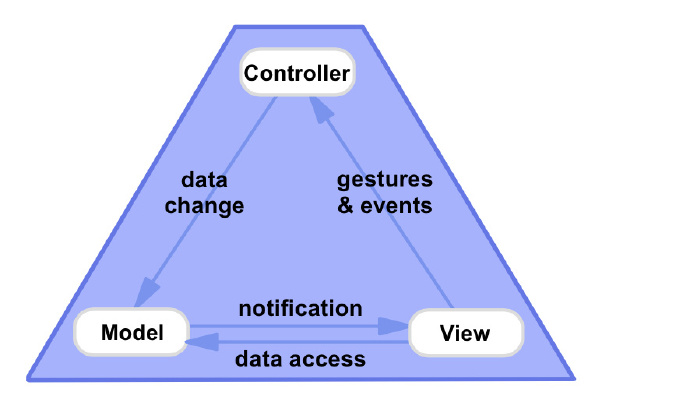
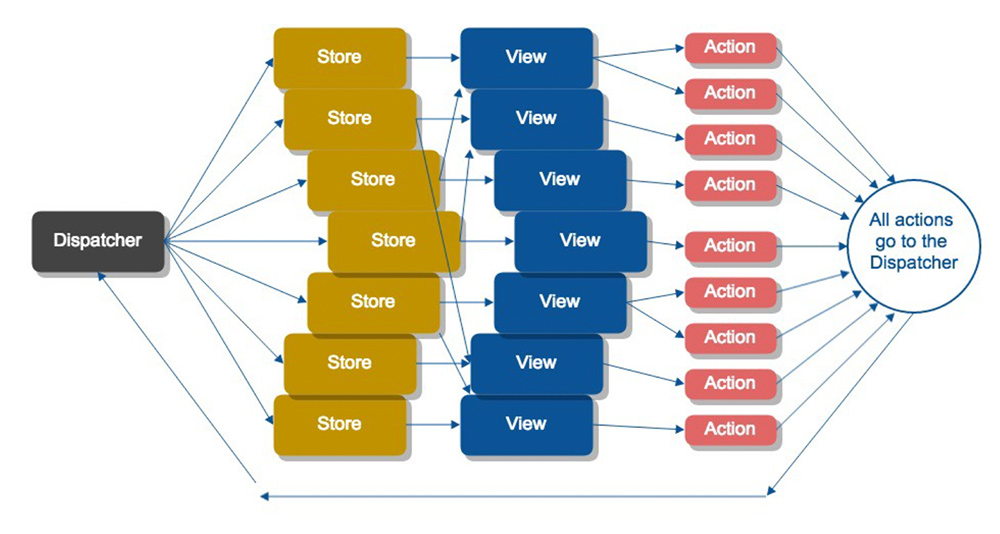

之前在网上看到过一位设计师这样说：现在绝大多数的网站做的其实只是把数据库里的内容展示到网页上，除此之外并没有做其他任何事情，所有的网站都是没有温度的。

他当然是在只是在批评当前网站的单一与乏味，但是我们仔细想想前半句话却觉得似乎很有道理，似乎整个web开发史就只是在反反复复的解决这一件事。

如何把数据展示到页面上，如何更快的把数据展示到页面上，如何更好的把数据展示到页面上，如何方便用户和展示到页面上的数据进行交互。web的发展史在重复的解决着这些问题，因此他们之间关系发展的历史也是web开发的发展史。

web的诞生时期

关于web的诞生网上的资料大致是这个样子：

> - 1989年3月: Tim Berners-Lee**撰写**了 “Information Management: A Proposal” 并在欧洲核子研究中心广泛征求意见。1990年10月，Tim Berners-Lee 开始进行使用NeXTStep开发环境开发超文本GUI浏览器及编辑器。他为这个项目命名为“万维网” 。
> - 1991年8月: 互联网上出现了通过FTP传送的万维网软件。
> - 1992年5月: Pei Wei的 “Viola” GUI 浏览器X测试版本诞生。
> - 1993年2月: 国家超级计算应用中心（National Center for Supercomputing Applications ）发布了编写的“**Mosaic** for X” 的第一份alpha版本。
> - 1993年4月: 欧洲核子研究中心宣布万维网技术将可以被人们免费使用，欧洲核子研究中心将不收取和此项技术相关的费用。
> - 1994年5月: 第一节国际万维网大会在日内瓦的欧洲核子研究中心召开。
> - 1994年10月: 万维网联盟（World Wide Web Consortium ，即W3C）成立。

确切的时间并不重要，有人认为是1989年3月因为那个时候概念第一次被提出来，但是也有人认为是91年，因为那个时候这个概念才算第一次落地。

但是正真意义上的web开发的诞生就是浏览器诞生之后了。那个时候我们的web开发，其实就是内容开发，它与今天我们做PPT，写word文档没有什么本质不同。为什么说在当时web开发等同于内容开发呢？看看HTML的全称就知道了，Hypertext Markup Language ，超文本标记语言。


```html
<header>
    <title>The World Wide Web project</title>
    <nextid n="55">
</header>
<body>
    <h1>World Wide Web</h1>
    The WorldWideWeb (W3) is a wide-area
    <a name="0" href="WhatIs.html">
    hypermedia
    </a> information retrieval initiative aiming to give universal access to a large universe of documents.
    <p>Everything there is online about W3 is linked directly or indirectly to this document, including an
    	<a name="24" href="Summary.html">executive summary</a> of the project,
    	<a name="29" href="Administration/Mailing/Overview.html">Mailing lists</a> ,
    	<a name="30" href="Policy.html">Policy</a> , November's
    	<a name="34" href="News/9211.html">W3  news</a> ,
    	<a name="41" href="FAQ/List.html">Frequently Asked Questions</a> .
    	<dl>
    		<dt><a name="44" href="../DataSources/Top.html">What's out there?</a>
    		<dd> Pointers to the world's online information,<a name="45" href="../DataSources/bySubject/Overview.html"> subjects</a>
    , 
    		<a name="z54" href="../DataSources/WWW/Servers.html">W3 servers</a>, etc.
    		<dt><a name="46" href="Help.html">Help</a>
    		<dd> on the browser you are using
    		<dt><a name="13" href="Status.html">Software Products</a>
    		<dd> A list of W3 project
    		...
```

我们看代码其实就是普通的HTML，所以那个时候的数据和视图的关系甚至说不上耦合，因为数据本身就是视图。

CGI时代

web诞生之初所有的页面几乎都是人肉编写，服务器接收到对特定文件的请求，然后找到对应文件，丢给客户端。出于对动态内容的需要，人们定义了 CGI 。

CGI （ Common Gateway Interface / 通用网关接口 ）它定义了web服务器与应用程序之间通讯的接口。有了CGI，web从之间返回给浏览器静态内容变成了，拿到URL解析出其中的参数，判断是否请求的是静态资源然后如果是动态资源，那么把解析出的参数丢给CGI程序，CGI调用外部数据库或者直接返回输出的内容给服务器。然后服务器把输出之间返回给浏览器。


```c
/*
 * parse_uri - parse URI into filename and CGI args
 *             return 0 if dynamic content, 1 if static
 */
/* $begin parse_uri */
int parse_uri(char *uri, char *filename, char *cgiargs) 
{
    char *ptr;

    if (!strstr(uri, "cgi-bin")) {  /* Static content */ 
      strcpy(cgiargs, "");                             
      strcpy(filename, ".");                           
      strcat(filename, uri);                           
      if (uri[strlen(uri)-1] == '/')                   
          strcat(filename, "home.html");               
      return 1;
    }
    else {  /* Dynamic content */                        
      ptr = index(uri, '?');                           
      if (ptr) {
          strcpy(cgiargs, ptr+1);
          *ptr = '\0';
	}
	else {
	    strcpy(cgiargs, "");                         
		strcpy(filename, ".");                           
		strcat(filename, uri);                           
		return 0;
    }
}
/* $end parse_uri */
```

这是《深入理解计算机系统》里一个服务器实现的一段代码，作用呢就是判断URL是直接请求静态资源还是动态内容。全部内容可以在原书里找到。

Web编程语言时代

CGI程序一般返回的都是HTML内容，用当时的 C/C++ ，或者Perl语言直接来处理字符串，想想就会非常的酸爽。所以需要一些库或者之间在语言层面把这部分的工作给处理掉 。

最好是这样，返回结果里永远不会变化的那部分的就放在一个固定的地方，然后动态的内容来填充这部分内容。

基于这个想法，伟大的PHP诞生了。

PHP（ Hypertext Preprocessor / 超文本预处理器 ）最早由 Rasmus Lerdorf 在1995年发明。它自带了对于模板的支持，可以把动态内容写在模板里，直接输出模板。

```php
<?php
if (strpos($_SERVER['HTTP_USER_AGENT'], 'MSIE') !== FALSE) {
?>
<h3>strpos() 肯定没有返回假 (FALSE)</h3>
<p>正在使用 Internet Explorer</p>
<?php
} else {
?>
<h3>strpos() 肯定返回假 (FALSE)</h3>
<center><b>没有使用 Internet Explorer</b></center>
<?php
}
?>
```

PHP的一个小例子，通过UA来判断当前浏览器是否为IE，因为混合了html模板，可以在代码里直观的看到输出的结果。

随着web的发展，逐渐出现了其他的web脚本语言，比如ASP和JSP脚本语言。这个时期的数据可以说是耦合在视图里的，开发者会直接在脚本里编写sql语句来查询数据，吐给服务器。

这个时期 java 语言的jsp规范里提出了一个JSP Model 2 模型，并且将其定义为一种架构模式。这个东西最大的意义是把MVC 这种GUI编程架构带到了Web。


这个时期 JAVA web的各种基础应用的发展使得java提出了j2ee的web架构，而微软则提出了.net 开发平台。

MVC开发框架时代

2004年，DHH（David Heinemeier Hansson）在开发Basecamp的时候发现无论是php还是java来开发web应用都不怎么满意，然后在好友的建议下使用了ruby 并且一见钟情，于是在产品开发完毕后抽出了其中的框架，并且命名为Ruby on Rails。


结合这张图片我们看一下rails的具体运作流程，

首先用户发送一个请求：

http://localhost:3000/articles/index

这个请求被router拦截：

```ruby
Rails::Application.routes.draw do
  get "articles/index" => "articles#index"
  # ...
end
```

并且分发给welcom controller的say action

```ruby

class ArticlesController < ApplicationController
  def index
    @articles = Article.all
  end
 
  def show
    ...
  end
 
  def new
    ...
  end
```

controller把数据丢给view

```ruby
<h1>Listing articles</h1>
 
<table>
  <tr>
    <th>Title</th>
    <th>Text</th>
  </tr>
 
  <% @articles.each do |article| %>
    <tr>
      <td><%= article.title %></td>
      <td><%= article.text %></td>
    </tr>
  <% end %>
</table>
```

最后输出HTML返回给用户。

SAP（Single Page Application / 单页应用）

2005年出现的AJAX这个概念使得 JavaScript 催生了现代意义上的前端。AJAX即“Asynchronous JavaScript and XML”（异步的JavaScript与XML技术）。使得页面可以进行局部刷新，而不是每次都重新请求新的页面，Google的一系列产品比如Gmail，google map的成功使得 AJAX 的应用变得越来越广泛。

于是出现了SAP这个概念，SAP的出现没有改变后端web框架的模式，但是却将View也就是视图层的复杂度全部挪到了前端。于是，直接使用脚本方式的js越来越无法满足web开发的需要，催生出了前端的MVC框架。

前端MVC与传统MVC的区别

首先是前端的Controller的定义很模糊，因为很多控件的存在，它往往即是View又是Controller。这直接到了MVC的单一职责原则。

其次，在后端的MVC框架里，每个请求作为一个Action，然而SAP应用里，Action的来源则有可能会有很多，既有可能是来自于用户的输入，也有可能来自于URL的改变，甚至是web程序本身。

还有就是Model，前端MVC的Model不光要保存应用相关的状态（即从Server端拿到的数据），同时还要维护UI状态，比如Dropdown，Modal等组件的显示或者是隐藏。

因此和后端MVC框架相比，前端框架的架构更像这个样子：



区别在于Model和View是可以直接通讯的，但是View和Model直接通讯会带来诸多维护上的问题，最大的问题数据和界面同步的问题，

解决这个问题的关键在于阻止View和Model进行直接通讯，于是我们可以将上图中一部分可以和View进行通讯的Model拿出来作为View-model，同时把Controller里面用于同步View和Model关系的部分也放到View-model里，然后他们之间的关系就变成这样。


Vue作为一个视图框架实现了的视图和数据的双向绑定功能

```jsx
<div id="app-6">
  <p>{{ message }}</p>
  <input v-model="message">
</div>
```

```jsx
var app6 = new Vue({
  el: '#app-6',
  data: {
    message: 'Hello Vue!'
  }
})
```


传统的MV*框架存在着数据流不清晰的问题，因为View和Model直接的通信往往都是双向的。


因此为了让数据流更加清楚，Facebook提出了单向数据流的Flux框架。


用户发出一个Action Dispatcher收到Action 分发给Store，Store根据Action的类型来改变数据，然后通知View，View收到通知更新界面。

如果需要从View来更新数据的话就添加一个Action，这样即使在应用很复杂的情况下，数据的流向也会变得很清楚了。



总结一下，事实上纵观web发展史，框架直接的架构本质上来看在传统web开发框架Rails出现之后久没发生太大变化了，后面的几乎都是这种模式的变体，web还在发展，也肯定会有旧的框架死掉，新的框架出来，抓住其中的核心才是最关键的。


最后本文内容参考了众多资料：

这里只列出最主要的几篇，感谢他们用心写下的文章。

https://www.zhihu.com/question/22689579/answer/87879505

http://draveness.me/mvx.html

http://www.cnblogs.com/winter-cn/p/4285171.html